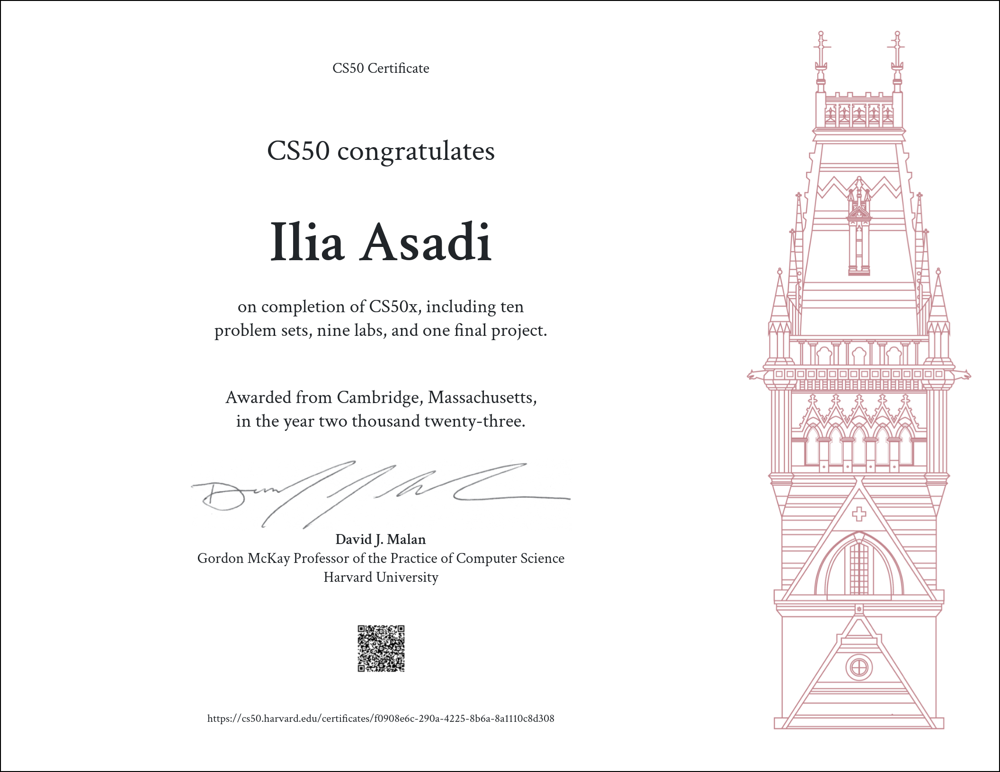
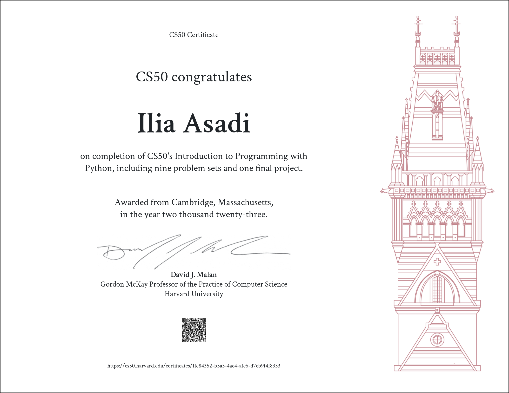

<h1 align="center">
  Ilia Geek
</h1>

<h1 align="center">
  
</h1>

<h6 align="center">Hello, World!
 
Geek, Musician, Programmer, { Linux, Art, Philosophy & Freedom Lover }
</h4>

* * *

<h1>

CS50x & CS50P Certificates - Harvard University

</h1>

* * *

<h1 align="center"> My Specialties </h1>

  

 

<h1 align="center"> My Social Networks </h1>

  
    
    </a>
    
    
    
  

